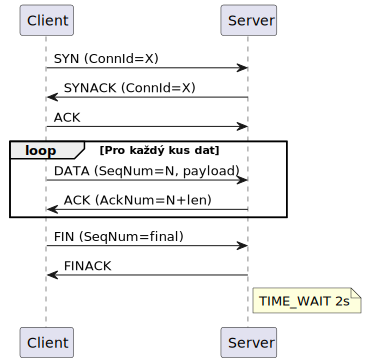
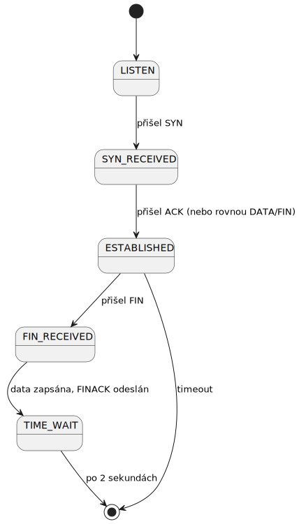

# IPK Projekt 2 – Spolehlivý přenos souborů přes UDP

**Autor:** Lukáš Dudek
**Jazyk:** Go (1.23)
**Spustitelný soubor:** `ipk-rdt`

---

## Popis projektu

Tento projekt implementuje spolehlivý přenos souborů přes protokol UDP. Cílem bylo navrhnout a naprogramovat protokol, který zajišťuje vlastnosti podobné TCP (spolehlivost doručení, zachování pořadí dat) nad nespolehlivým transportním protokolem. Celé řešení je obsaženo v jediné binárce `ipk-rdt`, která může fungovat v režimu **klienta** (odesílatele) nebo **serveru** (příjemce).

**Hlavní vlastnosti:**

- Spolehlivý přenos dat se zachováním správného pořadí.
- Navazování spojení pomocí třícestného handshaku (SYN -> SYNACK -> ACK).
- Zpracování přes posuvné okno (Sliding Window) s využitím kumulativního potvrzování (strategie Go-Back-N).
- Fast retransmit – okamžité odeslání nejstaršího nepotvrzeného paketu při příjmu 3 duplicitních ACK.
- Retransmise s exponenciálním backoffem při opakovaných ztrátách (RTO).
- Kontrola integrity dat přes CRC32-IEEE.
- Relace identifikované pomocí náhodného 32-bitového `ConnId`.
- Korektní ukončení spojení (FIN -> FINACK + TIME_WAIT).

---

## Sestavení a spuštění

### Sestavení

Projekt lze sestavit standardně přes `make`:

```bash
make
```

Výsledkem je spustitelný soubor `ipk-rdt`.

### Nix Dev Shell

Pokud používáte Nix, můžete využít příkaz:

```bash
make NixDevShellName   # vypíše "go"
```

### Spuštění Serveru (Receiver)

```bash
./ipk-rdt -s -p PORT [-a ADDRESS] [-o OUTPUT] [-w TIMEOUT] [-h | --help]
```

- `-s`: Spustí program v režimu serveru.
- `-p PORT`: Port, na kterém server naslouchá (**povinný parametr**).
- `-o OUTPUT`: Cílový soubor pro uložení přijatých dat (výchozí je stdout, `-` značí také stdout).
- `-w TIMEOUT`: Inactivity timeout v sekundách (výchozí hodnota je 1s).
- `-v`: Verbose mód – zapne výpis diagnostických zpráv na stderr (ve výchozím stavu je stderr čistý).

### Spuštění Klienta (Sender)

```bash
./ipk-rdt -c -a HOST -p PORT [-i INPUT] [-w TIMEOUT] [-h | --help]
```

- `-c`: Zapne klient mode.
- `-a HOST`: Kam to poslat (**povinný**).
- `-p PORT`: Cílový port (**povinný**).
- `-i INPUT`: Co poslat (standardně bere ze stdin).
- `-v`: Verbose mode – diagnostické zprávy na stderr.

### Příklady spuštění

```bash
# Přenos souboru na lokálním rozhraní
./ipk-rdt -s -p 9000 -o received.bin &
./ipk-rdt -c -a 127.0.0.1 -p 9000 -i sample.bin

# Odeslání textu přes rouru (pipe)
printf 'Ahoj IPK!\n' | ./ipk-rdt -c -a 127.0.0.1 -p 9000
```

---

## Architektura protokolu

### Formát paketu (PDU)

Každý paket je navržen tak, aby se vešel do jednoho UDP datagramu. Maximální velikost payloadu (datové části) je omezena na **1100 bytů**, což spolu s hlavičkou zajišťuje bezpečné splnění limitu 1200 bytů.

- **Magic byte (0x55):** Slouží k počáteční identifikaci paketu.
- **Type:** Typ paketu: SYN(1), SYNACK(2), DATA(3), ACK(4), FIN(5), FINACK(6).
- **ConnId:** Identifikátor relace pro rozlišení spojení.
- **SeqNum:** Sekvenční číslo (v bajtech).
- **AckNum:** Očekávané sekvenční číslo (kumulativní potvrzení).
- **Checksum:** Kontrolní součet CRC32 přes celý paket (při výpočtu se toto pole dočasně nuluje).
- **Length:** Délka payloadu v bajtech.

---

### Navazování spojení (Handshake)

Spojení je iniciováno klasickým třícestným handshakem:

1. **Klient -> Server (SYN):** Klient vygeneruje náhodné `ConnId` a odešle SYN paket.
2. **Server -> Klient (SYNACK):** Server odpoví SYNACK paketem se stejným `ConnId`.
3. **Klient -> Server (ACK):** Klient potvrdí přijetí. Pokud klient rovnou začne odesílat DATA, server je akceptuje a považuje handshake za úspěšně dokončený.

Obě strany využívají retransmisní časovače (výchozí hodnota 500 ms) pro případ ztráty řídicích paketů.

---

### Přenos dat – Sliding Window & Go-Back-N

Odesílatel využívá **posuvné okno** s pevnou velikostí **16 segmentů** (což odpovídá cca 17,6 KB neodeslaných dat):

- `baseSeq` – sekvenční číslo nejstaršího nepotvrzeného paketu.
- `nextSeq` – sekvenční číslo pro další odesílaný paket.
- Okno se posouvá vpřed na základě přijatých kumulativních ACK.

Příjemce akceptuje data ve správném pořadí. Segmenty, které dorazí mimo pořadí (out-of-order), jsou **uloženy do lokálního bufferu** a na výstup se zapíší až ve chvíli, kdy dorazí chybějící předchozí segmenty.

---

### Strategie znovuodesílání (Retransmission)

1. **Timeouty (RTO):** Každý segment v okně má nezávislý časovač. Počáteční hodnota RTO je **500 ms**. Při vypršení časovače dochází k retransmisi a hodnota RTO se zdvojnásobuje (exponenciální backoff) až do maximální hodnoty **1500 ms**.
2. **Fast Retransmit:** Pokud odesílatel obdrží **3 duplicitní ACKy** (stejná hodnota `AckNum`), nečeká na vypršení RTO a okamžitě znovu odešle paket očekávaný přijímačem.
3. **Inactivity Timeout:** Pokud během doby specifikované parametrem `-w` nedojde k žádnému síťovému provozu, aplikace ukončí spojení s chybou.
4. **Pacing:** Mezi odesláním jednotlivých paketů je zařazena **1ms pauza**, která slouží jako prevence proti zahlcení kernelového UDP bufferu při burst přenosu.

---

### Identifikace a detekce chyb

- **ConnId:** Zabraňuje záměně paketů pocházejících z různých relací.
- **Detekce chyb:** K ověření integrity slouží standardní **CRC32-IEEE**. Pakety s neplatným kontrolním součtem, špatným magickým bytem nebo nesouhlasící délkou jsou zahozeny.

---

### Ukončení spojení (Teardown)

1. **Klient -> Server (FIN):** Po odeslání a potvrzení všech dat odešle klient paket typu FIN.
2. **Server -> Klient (FINACK):** Server ověří, že zapsal veškerá doručená data, a odpoví paketem FINACK.
3. **TIME_WAIT:** Server následně po dobu **2 sekund** vyčkává, aby mohl případně zopakovat odeslání FINACKu, pokud by klient svůj FIN zaslal znovu (např. při ztrátě FINACKu). Po uplynutí této doby se server korektně ukončí.

---

## Parametry v kostce

- **Max payload:** 1100 bytů (aby se to i s hlavičkou vešlo do 1200B limitu).
- **Window size:** 16 segmentů.
- **RTO:** 500ms základ, max 1500ms.
- **SYN retry:** 500ms.

---

## Známé limity a možná vylepšení

1. **IPv6:** Implementace byla testována převážně na IPv4 a lokálním loopbacku (`::1`). Plnohodnotné testování přes vnější IPv6 sítě nebylo provedeno.
2. **Řízení kongesce (Congestion Control):** Protokol neobsahuje mechanismy jako Slow Start; velikost okna je fixně stanovena na 16.
3. **Selektivní potvrzování (SACK):** Protokol využívá pouze základní Go-Back-N. Příjemce sice bufferuje pakety mimo pořadí, ale nedokáže tuto skutečnost odesílateli explicitně sdělit, což může vést ke zbytečným retransmisím.
4. **Konkurence:** Server je navržen k obsloužení jednoho přenosu, po kterém se ukončí.
5. **Bezpečnost:** Přenášená data nejsou šifrována a parametr `ConnId` slouží pouze k identifikaci relace, nikoliv jako zabezpečení.

---

## Automatizované testy

Projekt obsahuje sadu testů ve složce `tests/`. Tyto testy lze spustit pomocí:

```bash
make test
```

Alternativně přímo přes nástroje jazyka Go:

```bash
cd tests && go test -v -timeout 300s .
```

### Co se testuje a co se očekává

| Test                                  | Vstup                                     | Očekávaný výstup / chování                     |
| ------------------------------------- | ----------------------------------------- | ---------------------------------------------------- |
| `TestCLI_NoArgs`                    | žádné argumenty                        | exit 1, chybová hláška na stderr                  |
| `TestCLI_MissingPort`               | `-c -a 127.0.0.1`                       | exit 1                                               |
| `TestCLI_Help`                      | `--help`                                | exit 0, usage na **stdout**, prázdný stderr |
| `TestProtocol_SerializeDeserialize` | libovolný packet                         | deserializace vrátí stejná data                   |
| `TestProtocol_BadChecksum`          | packet s upraveným bytem                 | `ParsePacket` vrátí chybu                        |
| `TestProtocol_BadMagic`             | packet s jiným magic bytem               | `ParsePacket` vrátí chybu                        |
| `TestTransfer_Empty`                | prázdný vstup (0 B)                     | server zapíše prázdný soubor, exit 0             |
| `TestTransfer_SmallText`            | `"hello world\n"` (12 B)                | přijatý soubor = odeslaný, byte-perfect shoda     |
| `TestTransfer_Boundary`             | přesně 1100 B                           | přijatý soubor = odeslaný                         |
| `TestTransfer_Large`                | 200 KB náhodných binárních dat        | SHA256 přijatého = SHA256 odeslaného              |
| `TestTransfer_AllBytes`             | všechny hodnoty 0x00–0xFF               | přijatý soubor = odeslaný                         |
| `TestTransfer_StdinStdout`          | přenos přes pipe (`stdin`/`stdout`) | data přijata přesně                               |
| `TestTransfer_IPv6`                 | přenos na `[::1]`                      | přijatý soubor = odeslaný                         |

### Výsledky

Projekt úspěšně prochází většinou testů na referenčním prostředí. Základní funkcionalita (validace CLI argumentů, přenosy souborů různých velikostí a typů, kontrolní součty) funguje spolehlivě i při mírné ztrátovosti sítě (do 5 %).

Během pokročilých síťových testů byly zaznamenány následující limitace, které odpovídají zvolenému designu protokolu (Go-Back-N, fixní okno):

- **TestNetwork_PacketLoss10 a TestNetwork_DelayAndJitter:** Zátěžové testy se simulovaným 10% výpadkem paketů nebo výrazným zpožděním a jitterem končí chybou (timeout). Z důvodu absence adaptivního řízení toku (congestion control) a povahy algoritmu Go-Back-N se při takto vysoké míře chybovosti linka přesytí zbytečnými retransmisemi. Pro spolehlivost v těchto extrémních podmínkách by bylo nutné implementovat SACK nebo dynamické okno. Vzhledem k dokončení projektu těsně před termínem odevzdání na tohle vylepšení nezbyl prostor.
- **TestTransfer_IPv6:** Test je při výchozím nastavení přeskakován (`SKIP`), protože referenční prostředí nemá plně nakonfigurované rozhraní `[::1]`.

Zkrácený výstup z testování:

```text
=== RUN   TestNetwork_PacketLoss5
--- PASS: TestNetwork_PacketLoss5 (2.38s)
=== RUN   TestNetwork_PacketLoss10
    advanced_test.go:60: client: exit status 1
--- FAIL: TestNetwork_PacketLoss10 (15.25s)
=== RUN   TestNetwork_DelayAndJitter
    advanced_test.go:90: client: exit status 1
--- FAIL: TestNetwork_DelayAndJitter (15.75s)
...
=== RUN   TestTransfer_IPv6
    transfer_test.go:308: IPv6 client failed (maybe not available): exit status 1
--- SKIP: TestTransfer_IPv6 (0.21s)
FAIL
FAIL	ipk-proj2/tests	62.669s
```

---

## Diagramy (UML)

### Jak vypadá úspěšný přenos



### Stavový automat Serveru



---

## Návrhová rozhodnutí (Design Decisions)

1. **Volba jazyka Go:** Jazyk Go byl zvolen díky zkušenosti z minulého projektu a díky své nativní podpoře souběžnosti (gorutiny a kanály). Například asynchronní zpracování ACK paketů tak může běžet v samostatné gorutině, což zjednodušuje návrh.
2. **Volba Go-Back-N:** Tato strategie je sice oproti Selective Repeat méně efektivní při vysoké chybovosti, ale je implementačně mnohem přímočařejší a pro potřeby tohoto projektu je plně dostačující (Pro mě opravdu jednodušší).
3. **Volba CRC32:** Standardní algoritmus CRC32 nabízí mnohem robustnější detekci chyb než jednoduchý Internet Checksum (součet po 16 bitech). Go k tomuto účelu obsahuje vysoce optimalizovanou knihovnu `hash/crc32`.
4. **Fast Retransmit:** Tato optimalizace byla do protokolu přidána za účelem efektivního řešení náhodných ztrát izolovaných paketů bez nutnosti čekat na zdlouhavé vypršení retransmisního časovače (RTO).

---

## Reference

- RFC 768 – *User Datagram Protocol* (UDP)
- RFC 793 / RFC 9293 – *Transmission Control Protocol* (TCP), jako referenční model pro stavový automat a správu spojení
- RFC 6298 – *Computing TCP's Retransmission Timer*, základ pro exponenciální backoff a RTO
- Go standardní knihovna – `net`, `hash/crc32`, `math/rand`, `flag` (https://pkg.go.dev/)

### Použití AI nástrojů

Při vývoji jsem používal následující AI nástroje:

- **Google Gemini (Antigravity)** – pomoc s laděním edge-casů (empty file transfer, out-of-order teardown), konzultace problémů, na které jsem narazil a generování unit testů, dokumentace a Makefile. Na základě konzultace kódu od Gemini jsem do implementace zahrnul několik ulehčení/vylepšení, konkrétně:

  - Použití `binary.BigEndian` v `protocol.go` pro bezpečnější a čistší serializaci/deserializaci hlaviček (místo náchylných ručních bitových operací).
  - Použití nativních timeoutů `conn.SetReadDeadline()` v `receiver.go` a `sender.go`. Původně jsem timeouty řešil přes gorutiny a kanály, což způsobovalo memory leaky (zaseklé gorutiny na blokujícím I/O), na což jsem narazil a následně konzultoval s AI.

  Klíčová logika protokolu (sliding window, handshake, retransmission) byla ale navržena a implementována mnou.
- **GitHub Copilot** – autocomplete při psaní kódu.

---

## Licence

Projekt je pod MIT licencí. Více v souboru [LICENSE](./LICENSE).
